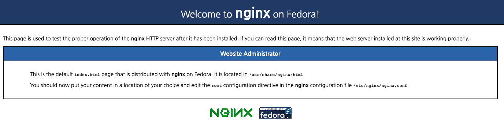

# nginx 인스톨하기.

## Centos 7 에 설치하기.

### EPEL 설치하기.

EPEL(Extra Packages for Enterprise Linux) 는 Fedora 에서 제공하는 패키지 저장소 입니다.

우선 최신의 nginx 를 설치하기 위해서 해당 패키지를 설치해 줍니다.

```
sudo yum install epel-release
```

### Nginx 설치하기.

```
sudo yum install nginx
```

### Nginx 실행, 정지 명령어

```
sudo systemctl start nginx
sudo systemctl stop nginx
sudo systemctl restart nginx
```

상기 명령어는 nginx 를 시작, 정지, 재시동 하는 명령어 입니다.

```
> ps -ef | grep nginx

root      4251     1  0 10:35 ?        00:00:00 nginx: master process /usr/sbin/nginx
nginx     4252  4251  0 10:35 ?        00:00:00 nginx: worker process
```

위와 같이 nginx 가 실행 되었습니다.

nginx 는 기본적으로 master 프로세스와, worker 프로세스로 나뉘어집니다.

### boot 시에 nginx 실행하기.

```
> sudo systemctl enable nginx

Created symlink from /etc/systemd/system/multi-user.target.wants/nginx.service to /usr/lib/systemd/system/nginx.service.
```

이렇게 해주면 시스템이 올라올때 nginx 를 자동으로 실행해 줍니다.

```
sudo systemctl disable nginx
```

위 명령은 nginx 를 부트시 자동실행하는 것을 해제합니다.

## 서버 확인하기. 

이제 정상적으로 서버가 떳는지 확인해 보겠습니다. 

http://localhost/



위와 같이 화면이 나온다면 정상적으로 설치가 되고 구동된 것입니다. 


