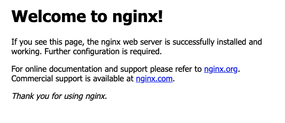

# nginx 인스톨하기.

## Ubuntu 에 설치하기.

### apt update

ubuntu 는 apt 라는 패키지 매니저를 이용합니다.

해당 패키지 매니저를 업데이트 하겠습니다.

```
sudo apt update
```

### Nginx 설치하기.

```
sudo apt-get install nginx
```

ubuntu 의 경우 설치하자마자 nignx 가 실행됩니다.

```
> ps -ef | grep nginx

root     13647     1  0 10:49 ?        00:00:00 nginx: master process /usr/sbin/nginx -g daemon on; master_process on;
www-data 13649 13647  0 10:49 ?        00:00:00 nginx: worker process
```

위와 같이 nginx 가 실행 되었습니다.

nginx 는 기본적으로 master 프로세스와, worker 프로세스로 나뉘어집니다.

### Nginx 실행, 정지 명령어

```
sudo systemctl start nginx
sudo systemctl stop nginx
sudo systemctl restart nginx
```

상기 명령어는 nginx 를 시작, 정지, 재시동 하는 명령어 입니다.

### boot 시에 nginx 실행하기.

```
> sudo systemctl enable nginx

Synchronizing state of nginx.service with SysV service script with /lib/systemd/systemd-sysv-install.
Executing: /lib/systemd/systemd-sysv-install enable nginx
```

이렇게 해주면 시스템이 올라올때 nginx 를 자동으로 실행해 줍니다.

```
> sudo systemctl disable nginx

Synchronizing state of nginx.service with SysV service script with /lib/systemd/systemd-sysv-install.
Executing: /lib/systemd/systemd-sysv-install disable nginx
```

위 명령은 nginx 를 부트시 자동실행하는 것을 해제합니다.

## 서버 확인하기.

이제 정상적으로 서버가 떳는지 확인해 보겠습니다.

http://localhost/



위와 같이 화면이 나온다면 정상적으로 설치가 되고 구동된 것입니다.
