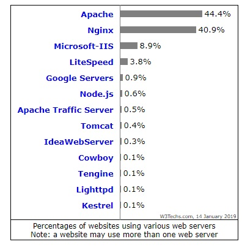

# Nginx 이해하기.

Nginx 는 오픈소스 프레임워크로 다음과 같은 일을 수행합니다.

-   web service
-   reverse proxy
-   content cache
-   load balance
-   media streaming

상기와 같은 역할을 수행할 수 있습니다.

## Apache 와 Nginx 비교

Apache 와 Nginx 는 아키텍처가 완전히 다릅니다.

Apache 는 프로세스 기반의 서비스로, 요청이 들어오면 새로운 스레드를 생성합니다.

Nginx 는 이벤트 드리븐 아키텍처를 사용하며, 복수개의 요청을 하나의 스레드에서 수행합니다.

### 기본 아키텍처

#### Apache

-   Process Driven
-   각 요청마다 스레드 신규 생성

아파치는 멀티 쓰레드를 이용한다. 멀티 쓰레드를 지원하는 다양한 처리 모듈을 제공한다.

Multi Processing Module (MPM) 은 서로다른 커넥션에 대해서 각각 다른 처리를 수행할 수 있는 기능을 제공한다.

멀티 쓰레드의 단점:

멀티 쓰레드는 제한된 자원인 CPU, 메모리를 점유하기 위한 경쟁이 발생하므로, 요청이 너무 많이 발생하는 경우 성능 이슈를 발생 시킬 수 있다.

또한 너무많은 쓰레드는 context switching 비용을 발생 시킨다.

#### Nginx

-   Event Driven
-   많은 요청을 받아들이는 이벤트 큐를 가진다. (비동기 처리가 수행된다.)
-   하나의 스레드를 통해서 큐의 이벤트를 처리할 수 있도록 한다.

Nginx 는 넌블로킹 이벤트 드리븐 커넥션을 핸들링 할 수 있는 알고리즘을 제공하므로 수천개의 커넥션을 하나의 쓰레드에서 처리할 수 있다.

### 정적 컨텐츠

-   Apache 의 경우 정적 리소스를 파일 기반의 접근을 통해서 서비스 한다.
-   nginx 는 nginx가 가진 이벤트 드리븐 방식으로 인해서 Apache 보다 더 빠르다.

테스트 자료를 보면 약 2.5배 더 nginx 가 빠르다.

### 동적 컨텐츠

-   Apache 는 동적 컨텐츠를 서버에서 직접 처리한다. Apache 서버가 바로 PHP 서버라는 것을 상기해보자.
-   Nginx 는 동적 컨텐츠를 직접 처리하지 않고, 다른 서버로 위임한다. SCGI, FastCGI 모듈을 이용하여 이러한 작업을 수행한다.

### 요청 처리방식

-   Apache 는 파일 시스템 위치를 통해서 찾아가는 방식 (이 부분이 성능 저하의 요인이 되기도함)
-   Nginx 는 url 기반의 요청을 처리한다.

### 전반적인 비교.

#### Apache

-   웹 서버용으로 설계됨
-   무거운 웹 트래픽에서 복수의 요청을 처리하기에는 좋은 선택은 아님.
-   클라이언트 요청에 대해서 멀티 쓰레드 이용
-   모듈을 동적으로 로드 하거나 언로딩 하는 유연성 제공
-   동적 컨텐츠를 웹서버 자체로 지원

#### Nginx

-   웹서버, 리버스 프록시 서버 둘다 아용
-   제한된 리소스들로 복수의 클라이언트 요청을 동시에 처리하기는 쉽지 않음
-   클라이언트 요청에 대해서 이벤트 드리븐으로 처리됨
-   모듈들은 동적으로 로드되지 않는것이 많음, 모듈 지원을 위해서 컴파일 필요
-   동적 컨텐츠를 자체적으로 지원하지 않음

## 사용 추이

from: [https://www.maketecheasier.com/nginx-vs-apache/](https://www.maketecheasier.com/nginx-vs-apache/)

위 그림을 보면 여전히 Apache 가 인기가 있습니다.

물론 Nginx 역시 Apache와 별반 차이 없이 사용하고 있습니다.

# 결론

간단하게 Nginx 와 Apache 를 알아보았습니다.

큰 차이는 없지만, nginx 는 가볍고 빠른 요청 처리를 위한 서버로 많이 이용되는 추세인듯 합니다.
